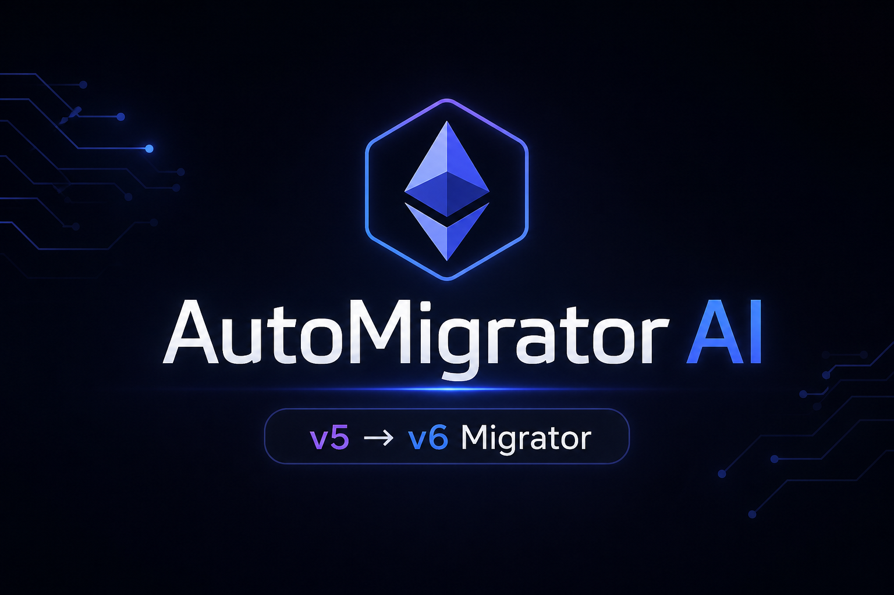

# AutoMigrator AI Engine

Motor de migración determinista y asistido por IA para actualizar **ethers.js de v5 a v6**.

[](https://angietatianaalbaamado-bot.github.io/automigrator-ai/)
[](https://opensource.org/licenses/MIT)

---

## El Problema
Migrar de `ethers.js` v5 a v6 implica cambios profundos en la API, refactorizaciones manuales extensas y un alto riesgo de errores humanos. Los métodos tradicionales de migración no escalan para repositorios profesionales.

## La Solución: Enfoque Híbrido
**AutoMigrator AI** automatiza este proceso mediante un flujo de trabajo de dos capas:

### 1. Motor de Transformación AST (jssg)
Utilizamos el motor `jssg` para aplicar cambios estructurales seguros, garantizando **cero falsos positivos**.

**Funciones clave del motor:**
*   **Refactorización de Proveedores:** Automatiza la migración de `ethers.providers.X` a `ethers.X`.
*   **Limpieza de utilidades:** Convierte `ethers.utils.X` a `ethers.X` de forma masiva.
*   **Migración de Providers de Navegador:** Automatiza `Web3Provider` a `BrowserProvider`.
*   **Optimización de llamadas a contratos:** Convierte `contract.callStatic.method(...)` a `contract.method.staticCall(...)`.

### 2. Capa Asistida por IA
Gestiona los casos excepcionales que el análisis determinista no puede resolver automáticamente, como patrones no estándar o lógica de negocio compleja.

---

## Cómo usar

### Ejecutar migración por CLI
Utiliza el motor oficial `jssg` para realizar la migración en tu repositorio:
```bash
npx codemod jssg run rules.js . --language javascript
```

### Ejecutar Interfaz Web (Dashboard)
```bash
npm run demo
# Abrir en http://127.0.0.1:8080
```

---

## Resultados Esperados
*   **Automatización:** >80% de los patrones de migración cubiertos.
*   **Fiabilidad:** Cambios deterministas y seguros.
*   **Impacto:** Reducción drástica del tiempo de mantenimiento.

---

## Hackathon: Boring AI 2026
Proyecto desarrollado para automatizar tareas repetitivas mediante IA, garantizando un flujo de trabajo de nivel profesional.

## Autor
Angie Tatiana Alba Amado

## Licencia
Este proyecto está bajo la licencia **MIT**. Consulta el archivo `LICENSE` para más información.